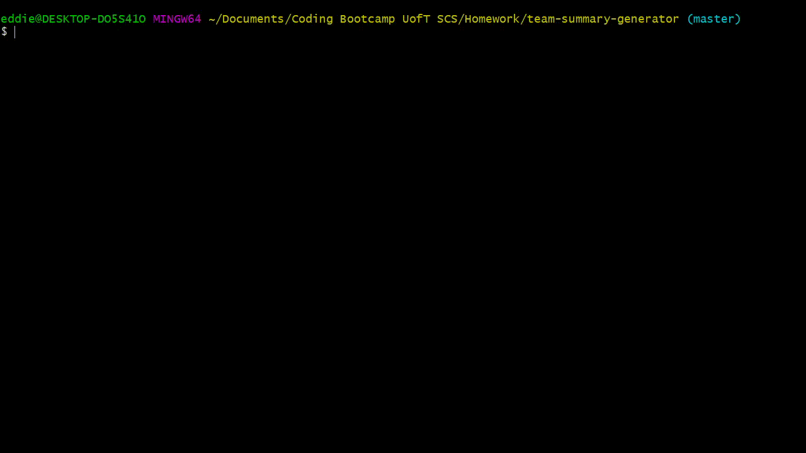
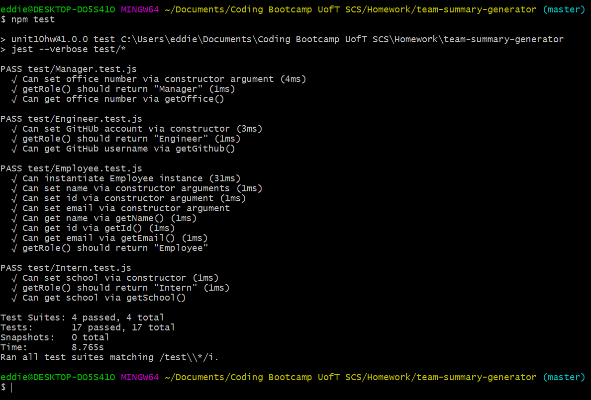

   

# Team Summary Generator

1. [Description](#toc-desc)

2. [Installation](#toc-install)

3. [Usage](#toc-usage)

4. [License](#toc-license)

5. [Contributing](#toc-contrib)

6. [Tests](#toc-tests)

7. [Questions](#toc-contact)

<a id='toc-desc'></a>
## Description
This CLI receives user input of the details of a team consisting of a Manager and any number of subordinate Interns and Engineers. It outputs an HTML file returning these details in a clean format.

<a id='toc-install'></a>
## Installation
Branch this repo and pull that branch to your local machine.

<a id='toc-usage'></a>
## Usage
```sh
node app.js
```



<a id='toc-license'></a>
## License
MIT

<a id='toc-contrib'></a>
## Contributing
This repository is not accepting contributors.

<a id='toc-tests'></a>
## Tests


<a id='toc-contact'></a>
## Questions


Please direct any questions, concerns, and compliments to [EddiEsteban](https://github.com/EddiEsteban)
 
